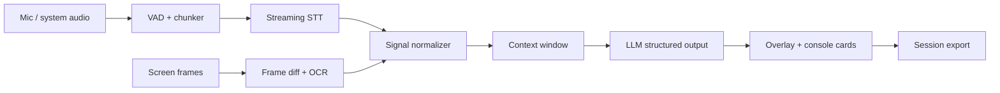

# Architecture

Interview Assessor AI is a desktop-first assistant for interviewers and examiners. It is designed around explicit consent, visible capture state, and auditable session exports.

## Layers

1. **Desktop shell**
   - Electron main process owns windows, overlay, permissions, and packaging.
   - React renderer owns the assessment console.
   - The overlay is a separate transparent always-on-top window opened from the main process.

2. **Capture adapters**
   - Current MVP uses Chromium `getDisplayMedia` and `getUserMedia`.
   - macOS production adapter: ScreenCaptureKit for selected window/display frames and audio.
   - Windows production adapter: Windows.Graphics.Capture for selected window/display frames.

3. **Recognition adapters**
   - Oral mode: stream audio chunks to STT and append final utterances to the signal feed.
   - Text mode: sample frames, calculate visual deltas, OCR only changed regions, deduplicate recognized text.
   - Coding mode: combine screen OCR, editor window title, clipboard-safe manual notes, and optional audio.

4. **Assessment engine**
   - Converts transcript/OCR signals into structured cards:
     - follow-up questions
     - rubric observations
     - risk flags
     - short summaries
   - The UI consumes only normalized `TranscriptItem` and `InsightCard` objects.

5. **Export**
   - Session data is exported as JSON in the MVP.
   - Markdown/PDF exports can be added without changing the capture layer.

## Production recognition path

## Safety boundaries

- No hidden capture.
- No stealth overlay.
- No bypass of proctoring or interview platform controls.
- Clear recording state in the UI.
- Session export remains local unless the operator explicitly sends data to a cloud model.

